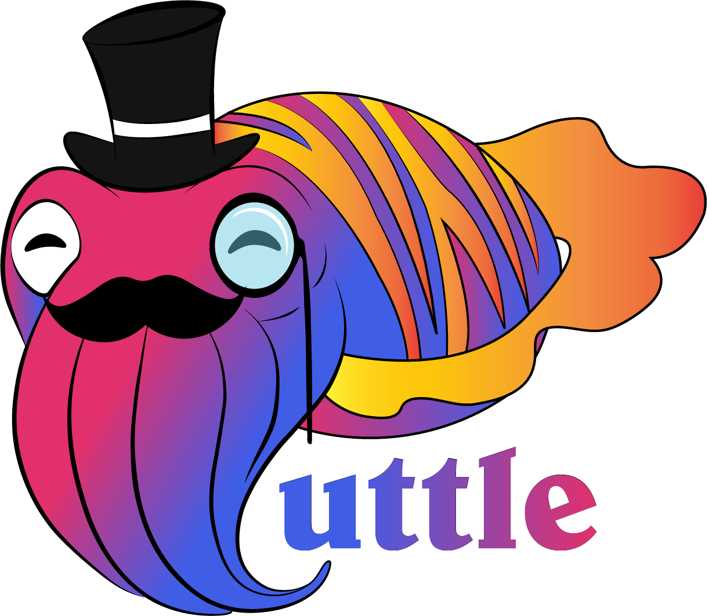

<div align="center">
	<p>
		<a href="https://cuttle.cards" title="Cuttle Website">
			
		</a>
	</p>
	<p>
		<a href="https://cuttle.cards" title="Cuttle Website">Website</a> | <a href="https://cuttle-cards.github.io/cuttle/" title="Cuttle Design Guide">Design Guide</a> | <a href="#community" title="Cuttle Community">Community</a>
	</p>
</div>

# Cuttle

This repository is the full-stack web app for [Cuttle](https://www.cuttle.cards), the pvp card game. The client (front-end) is a Single Page Application (SPA) built in [VueJs](https://vuejs.org/v2/guide/) using [Vuetify](https://vuetifyjs.com/en/getting-started/installation/). The server (back-end) that maintains the API is a [Node.js](https://nodejs.org/en/) application build with [Sails.Js](https://sailsjs.com/get-started). The application is tested end-to-end using [Cypress](https://docs.cypress.io/).

To play the game you will need to boot both the front & back end servers, then navigate to `localhost:8080` in your browser of choice.

## Project setup and development

### Download nodeJs
[nodeJs](https://nodejs.org/en/) lets you create & run web servers in javascript (along with other fancy system-level stuff not needed for this project). Both the client and server depend on node as the main system-wide dependency. The download comes with npm (node package manageer) which you'll use to install the project-specific dependencies.

**You should install version 16.xx.xx** (Left-side download) as this is the latest **stable** version.

**NOTE** When running on your local computer, signup/login only stores credentials on your computer and in memory. Shutting down the server wipes the in-memory database along with all game & account data.

### Setup

#### Download the Code

##### Using git
```
git clone https://github.com/cuttle-cards/cuttle
```
##### Or [Download](https://github.com/cuttle-cards/cuttle/archive/refs/heads/main.zip) as .zip
#### Install Dependencies
Open your shell/terminal of choice, `cd` into the root folder of this repo and run
```
npm ci
```
**NOTE** `ci` (as opposed to `install`) is a 'clean install' which ensures versions exactly match package-lock.json).

#### Start the App
You can simultaneously run the server on `localhost:1337` and the client on `localhost:8080` with one command:
```
npm run start:dev
```

This will also automatically open up [Vue Devtools]. Alternatively, you can run them independantly with separate commands.

##### Start the Server (sails backend)
```
npm run start:server
```

##### Start the Client (Vue SPA)
Open another shell/terminal in the root folder of this repo and run
```
npm run start:client
```
to start the client on localhost:8080

#### Open in browser
Navigate to [localhost:8080](http:localhost:8080) in your browser of choice.

#### Shutting down
You can shut down the servers by hitting `ctrl + c` several times from the terminal windows they are running in. Shut down both servers to completely delete all game & account data.

### Development

#### Vue Devtools

To utilize [Vue Devtools](https://devtools.vuejs.org/), you can run
```
npm run start:devtools
```

Only dev builds include the Vue Devtools via `ENABLE_VUE_DEVTOOLS=true`. The two scripts that currently support Vue Devtool usage are `npm run start:dev` and `npm run e2e:gui`.

#### Build for production
From the root directory of the repo, you can run
```
npm run prod
```
to compile the Vue SPA into the `assets` directory, which will be statically served by the server (sails backend) at the same port on which it is running to support the API. You can now shut down the client and view the applicaion as its built for production at localhost:1337 (default port for sails).

If you just want to generate the production build, you can run
```
npm run build
```

#### Run the tests
While the application is running, (server + client) you can run
```
npm run e2e:client
```
to run the entire suite of end-to-end cypress tests against the client running at localhost:8080. This will execute the tests headlessly and output the results in your terminal.

You can also use
```
npm run e2e:gui
```
to open the cypress UI, which is useful for executing a single test file if you are for example developing a new feature or a fix and want to focus on that aspect of the application (and see how it performs). This is very helpful for localhost development.

Lastly, you can run
```
npm run e2e:server
```
to execute the entire test suite headlessly against localhost:1337, which you can use to test the last-built version of the application. This is effectively what is done in CI when a pull request is submitted agains the `main` branch of this repository.

**NOTE** you should run `npm run build` (see above) before this command so that the server (backend) serves the most up-to-date version of the client.

#### Linting (Formatting)
Format the project with
```
npm run lint:fix
```

and use
```
npm run lint
```
to check the formatting without autofixing problems. (This is what's run in CI when a PR is opened against the `main` branch).

#### Storybook (UX Documentation)
Run Storybook locally with
```
npm run storybook
```
 It will start automatically on localhost:6006 and open a new tab in your browser.

## Game Rules
### Players and Cards
Cuttle is a 2-player card game, played with a standard 52 card deck, without jokers. You can read the rules with interactive gif-previews the  [rules page](https://www.cuttle.cards/#/rules)

### Goal
The goal is to be the first player to have 21 **or more** points. When a player has 21 or more points, they win immediately and the game is over.

### Setting Up
Each player starts on one side of the game board and is dealt a hand from the deck. One player is dealt six cards; the other is dealt 5 and goes first. A *scrap pile* area is designated for destroyed cards.

### Playing
On your turn you must make exactly one of the following moves below.

### Moves
1. **Draw:**
You may draw one card from the deck and put it in your hand. You may not draw past the 8-card hand-limit. If the deck is empty, you may pass. If three consecutive turns end with a pass, the game is a draw.
	* Click the deck to draw a card

2. **Points:**
You may play any number card, Ace-Ten for the number of points shown on the card (Ace is one point). The first player to have 21 **or more** points wins.

	* To play a card for points, click a card in your hand to select it, then click your field.

3. **Scuttling:**
You may player a number card from your hand onto a lower valued number card that your opponent has played for points; this destroys both cards. You may also scuttle a card of the same rank, if your card has the higher suit. The suit order is Clubs (weakest) < Diamonds < Hearts < Spades (strongest).

	* To scuttle an opponent's point card, click a higher number card (Ace - Ten) in your hand to select it, then click the card you'd like to scuttle.

4. **Face Cards and Glasses Eights:**
Face cards and eights can be played as **Face Cards and Glasses Eights**. While on your board, Face Cards and Glasses Eights provide you advantages. An explanation of the different Face Cards and Glasses Eights can be found below.

	* To play a Face Card or Glasses Eight, click the card in your hand to select it, then click your field (in green) to play it.
5. **One-Offs:**
Ace-Sevens and also Nines can be played as **One-Offs**. Playing a card for a One-Off effect discards (to the scrap pile) in exchange for an effect, based on the rank of the card. A list of all the effects can be found below.

	* To play a card as a **One-Off**, click a card in your hand to select it, then click the **Scrap Pile** or an opponent's card to target.

### One-Offs

* **Ace**: Destroy all **Point** cards
* **Two**: One of two effects:
	1. Destroy **target Face Card or Glasses Eight**
	2. Counter **target One-Off** (play this when an opponent plays a **One-Off** effect to stop it from happening)
* **Three**: Choose one card from the **Scrap Pile** and put it in your hand.
* **Four**: Your opponent discards two cards of her choice from her hand to the **Scrap Pile**
* **Five**: Draw two cards from the **Deck**.
* **Six**: Destroy all **Face Cards and Glasses Eights**
* **Seven**: Reveal the top two cards from the **Deck** and choose one of them to play immediately. Play this card however you would like. The other card is placed back on top of the deck.
* **Nine**: Return an opponent's card on the board to their hand. It can't be played next turn.

### Face Cards & Glasses Eights
* **Eight**: While you control an Eight as a  **"Glasses Eight"**, your opponent plays with her hand revealed to you. Unlike one-offs, Glasses Eights remain under your control until destroyed.
* **Jack**: Play a jack on top of a **Point Card** to move it to your side of the board. You keep control of the point card as long as you control the top jack.
* **Queen**: While you control a Queen, your other cards cannot be **targeted** by your opponent's cards.
* **King**: While you have a King, the minimum points needed to win is reduced. Each additional King further reduces the limit.
	* 1 King: 14 points to win
	* 2 Kings: 10 points to win
	* 3 Kings: 7 points to win
	* 4 Kings: 5 points to win

### FAQ
#### Can I play a two to counter a point card? What about a scuttle? Can I play a two to destroy my opponent's Face Card or Glasses Eight on her turn?

Nope! Twos can only counter One-Offs. You can play a two to destroy a Face Card or Glasses Eight, but this takes your turn, unlike countering.

#### Do Queens protect against countering with a two?
Yes! Queens protect against **targeting**, when a card applies a unique effect to one specific card. This means your other cards (not the Queen, herself) are protected against Twos (either effect), Nines, and Jacks.

#### Can I counter a Two with a Two?
Heck yeah! Playing a Two to counter is a **One-Off**, which can be **countered** with a two. Stacked counters make for exciting plays.

#### Can I win by playing a King?
Yes. If you meet the required number of points, you win immediately. This means if you play a King when you already have enough points to meet the new limit, you win on that turn.

#### If I play an Ace or a Six, are my cards destroyed as well?
Yes. Aces and Sixes destroy all **Point Cards** and all **Face Cards and Glasses Eights**, respectively. That includes any that you have out. Try to avoid destroying many of your own cards!

#### Where can I play Cuttle?
You can play Cuttle anywhere you have a deck of cards and a friend! If you want to play online, there is only one place: [www.cuttle.cards](https://www.cuttle.cards)

#### Our contributors :star_struck:

<a href="https://github.com/cuttle-cards/cuttle/graphs/contributors">
  
</a>

<!-- Made with [contrib.rocks](https://contrib.rocks). -->

## Community

We have a very active Discord community and currently run 2 events per week.

- Wednesday Night Cuttle at 8:30pm EST
- Thursday Lunch Cuttle at 12:00pm EST

[](https://discord.gg/9vrAZ8xGyh)
